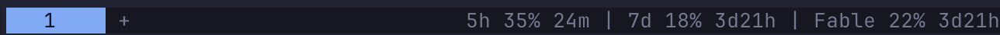

# herdr-quota

AI plan quotas in the [Herdr](https://herdr.dev) tab bar, one compact line:



Provider-pluggable. Ships with **Claude** (the same numbers Claude Code's `/status` shows:
5h session, 7d all-models, and every per-model weekly cap such as Fable, read from the
`limits` array of Anthropic's OAuth usage endpoint using the credentials Claude Code
already stores on the machine). No extra login.

## Install

```bash
herdr plugin install ArnaudRinquin/herdr-quota
herdr plugin list --plugin arnaud.quota --json | grep plugin_root   # where quota.py landed
```

(or `git clone` anywhere + `herdr plugin link <path>`.)

Add a command entry to the tab bar in `~/.config/herdr/config.toml` (Herdr ≥ 0.8.2),
pointing at `quota.py` inside that plugin root:

```toml
[ui]
tab_bar_right = [
  { type = "command", command = "python3 <plugin-root>/quota.py status", interval_seconds = 60, timeout_seconds = 15 },
]
```

Then `herdr server reload-config`. The tab bar strips colors, so the line is plain text.

`status`, the popup and the sidebar daemon share one cache
(`~/.local/state/herdr-quota/last.json`): at most one fetch every 5 minutes, whoever
asks first. Anthropic's usage endpoint returns 429 quickly when polled harder; a 429 keeps
the last good values on screen.

## Sidebar mode (optional)

Herdr metadata tokens are per-workspace, so showing quotas in the spaces sidebar means
hanging them off a dedicated **Quota** mini-space (a workspace whose cwd is the plugin
state dir, kept at the bottom of the list). If you prefer that:

```bash
herdr plugin action invoke start --plugin arnaud.quota   # daemon, republishes every 5 min
herdr plugin action invoke stop --plugin arnaud.quota    # clears tokens, closes the space
```

```toml
[ui.sidebar.spaces]
rows = [
  ["state_icon", "workspace"],
  ["branch", "git_status"],
  [{ token = "$q1_label", bold = true }, { token = "$q1_pct", fg = "#a6e3a1", bold = true }, { token = "$q1_reset", dim = true }],
  [{ token = "$q2_label", bold = true }, { token = "$q2_pct", fg = "#a6e3a1", bold = true }, { token = "$q2_reset", dim = true }],
  [{ token = "$q3_label", bold = true }, { token = "$q3_pct", fg = "#a6e3a1", bold = true }, { token = "$q3_reset", dim = true }],
]
```

Inline tables must stay on one line (TOML 1.0). On Herdr ≥ 0.9.0 the `%` tokens can change
color with usage (0.8.x rejects `rules`):

```toml
{ token = "$q1_pct", fg = "#a6e3a1", bold = true, rules = [{ equals = "100%", fg = "#f38ba8" }, { starts_with = "9", fg = "#f38ba8" }, { starts_with = "8", fg = "#fab387" }, { starts_with = "7", fg = "#f9e2af" }] },
```

(`starts_with` rather than `gt` because the value carries a `%`, which blocks numeric matching.)

## Popup

A floating pane with one bar per window, reset times, and the cache age. Open it with
`herdr plugin pane open --plugin arnaud.quota --entrypoint usage`, or bind it:

```toml
[[keys.command]]
key = "prefix+u"
type = "shell"
command = '"$HERDR_BIN_PATH" plugin pane open --plugin arnaud.quota --entrypoint usage'
```

## Sidebar tokens

| Token | Example |
|---|---|
| `$q_icon` | `✳` (one glyph per active provider) |
| `$q{i}_label` | `5h`, `7d`, `Fable` — prefixed with the provider name when several providers are active |
| `$q{i}_pct` | `28%` |
| `$q{i}_reset` | `1h6m`, `3d22h` — time until the window resets |

`i` runs 1..6 across all providers, in provider order. Missing windows vanish from the row.
Tokens carry a 25-minute TTL, so they disappear on their own if the daemon dies.

## Adding a provider

Drop `providers/<name>.py` exposing `NAME`, `ICON` and `windows()` returning
`[{"label": str, "pct": int, "resets_at": iso8601 | None}, ...]` (empty list when not
configured on this machine; raise `providers.RateLimited` on 429), and add it to
`load_all()` in `providers/__init__.py`. When more than one provider reports, the generic
`5h` / `7d` labels get the provider name in front (`Claude 5h`).

The Claude provider reads the OAuth token from the macOS Keychain item
`Claude Code-credentials`, falling back to `~/.claude/.credentials.json` (Linux).

## Commands

| | |
|---|---|
| `python3 quota.py status` | the tab-bar line |
| `herdr plugin action invoke start --plugin arnaud.quota` | start the sidebar monitor |
| `herdr plugin action invoke refresh --plugin arnaud.quota` | sidebar: fetch + publish once |
| `herdr plugin action invoke stop --plugin arnaud.quota` | sidebar: stop, clear tokens, close the mini-space |
| `herdr plugin pane open --plugin arnaud.quota --entrypoint usage` | detail popup |

Requirements: Herdr ≥ 0.8.2, `python3` (stdlib only), macOS or Linux, Claude Code logged in on the same machine.
